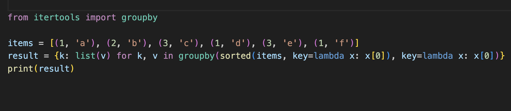

### Why learn oneliners in Python
- First, by improving your core Python skills, you’ll be able to overcome many of the small programming weaknesses that hold you back. It’s hard to make progress without a profound understanding of the basics.
  Single lines of code are the basic building block of any program. Understanding these basic building blocks will help you master high-level complexity without feeling overwhelmed.

- Learn how to leverage wildly popular Python libraries, such as those for data science and machine learning. The repo consists of five one-liner notebooks,
  each addressing a different area of Python, from regular expressions to machine learning. This approach will give you an overview of possible Python applications you can build, as well as teach you how to use
  these powerful libraries.

- Third, you’ll learn to write more Pythonic code. Python beginners, especially those coming from other programming languages, often write code in un-Pythonic ways. We’ll cover Python-specific concepts like list
   comprehension, multiple assignment, and slicing, all of which will help you write code that’s easily readable and sharable with other programmers in the field.
 
- Fourth, studying Python one-liners forces you to think clearly and concisely. When you’re making every single code symbol count, there’s no room for sparse and unfocused coding.

- Fifth, your new one-liner skill set will allow you to see through overly complicated Python codebases, and impress friends and interviewers alike. You may also find it fun and satisfying to solve challenging
   programming problems with a single line of code. And you wouldn’t be alone: a vibrant online community of Python geeks compete for the most compressed,
  most Pythonic solutions to various practical (and not-so-practical) problems.

